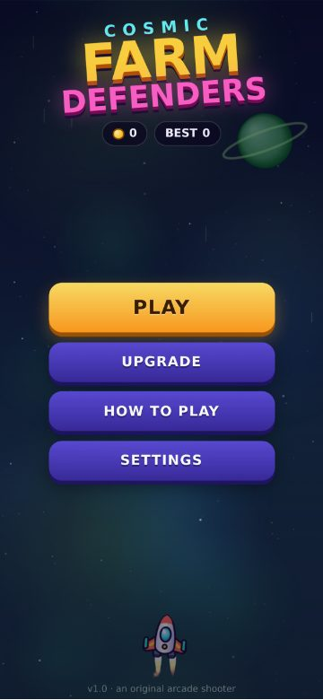
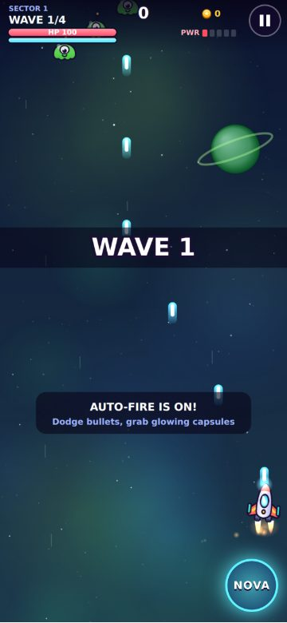
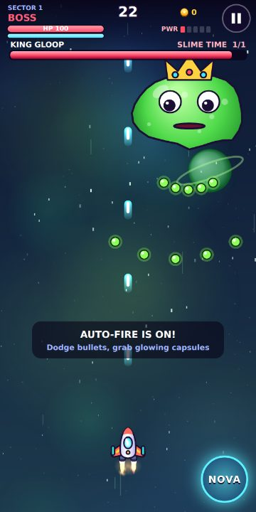
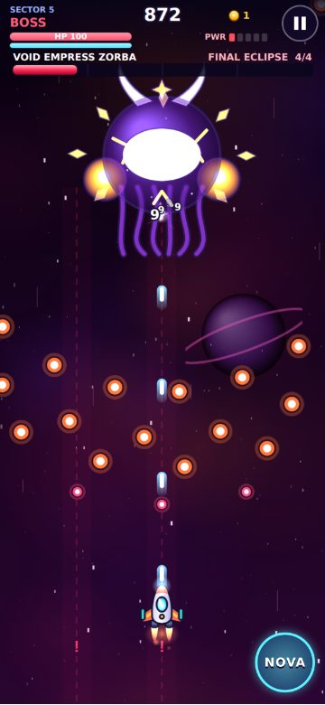
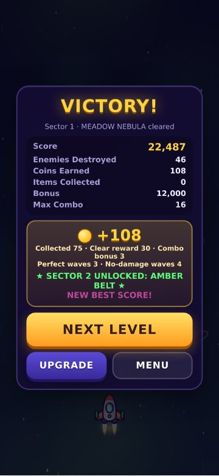
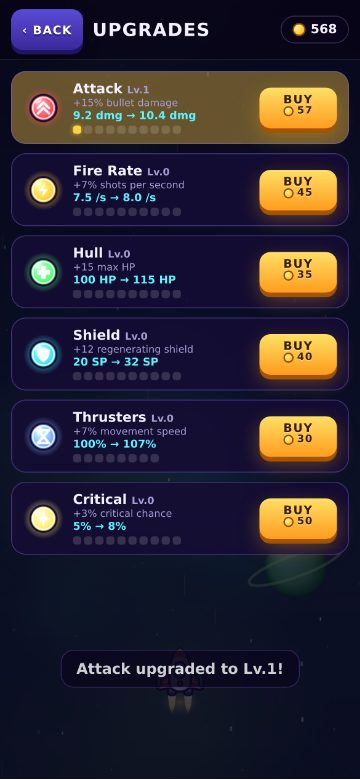
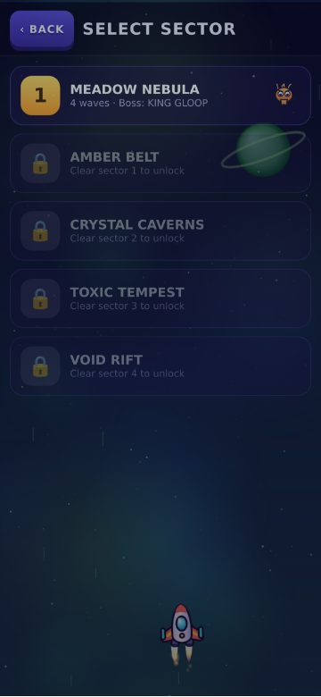
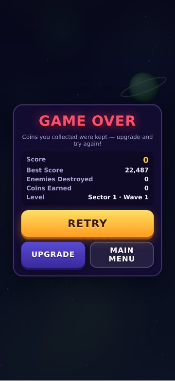

# 🚀 Cosmic Farm Defenders

Game **vertical space shooter** màn hình dọc, ưu tiên mobile, chạy trực tiếp trên trình duyệt điện thoại. Không cần backend, tài khoản, server, database hay API bên ngoài.

Toàn bộ tên game, nhân vật, quái, boss, UI, artwork, âm thanh đều **ORIGINAL**: art vẽ procedural bằng Canvas, âm thanh/nhạc tổng hợp bằng WebAudio, không dùng file asset nào.

<p>




</p>
<p>




</p>

## Game overview

Trang trại vũ trụ bị lũ sinh vật ngoài hành tinh tấn công. Bạn lái chiến đấu cơ **Starhopper**, vượt qua **5 sector**. Mỗi sector có 4–6 wave và một **boss** riêng:

| Sector | Tên | Boss | Đặc điểm |
|---|---|---|---|
| 1 | Meadow Nebula | KING GLOOP | Tutorial, 1 phase, bắn đơn giản, di chuyển trái/phải |
| 2 | Amber Belt | BUZZ BARON | Enemy nhanh hơn, 4 pattern, lao xuống (charge) có telegraph |
| 3 | Crystal Caverns | BROODMOTHER | Nhiều loại enemy, 2 phase, triệu hồi quái |
| 4 | Toxic Tempest | JELLYTRON | Bullet pattern phức tạp, bắn toả, di chuyển hình số 8, laser, triệu hồi |
| 5 | Void Rift | VOID EMPRESS ZORBA | Khó rõ rệt, 4 phase (100/75/50/25%), nova, laser, spiral, triệu hồi |

## Tech stack

- **HTML5 Canvas 2D + JavaScript thuần (ES modules)**. Không framework, **0 runtime dependency**.
- DOM/CSS cho menu và nút bấm (sắc nét, dễ bấm). HUD vẽ trên canvas.
- WebAudio: toàn bộ SFX và nhạc là procedural.
- localStorage để lưu game, có schema version và migration.
- Dev tools (không bắt buộc để chơi):
  - `esbuild` để build file đơn.
  - `playwright` cho E2E test.
  - `node --test` cho unit test.

## Project structure

```
index.html            # khung trang + tất cả screen (DOM)
styles.css            # UI mobile-first, safe-area, touch-action
dist/index.html       # bản build 1 file, mở trực tiếp được (file://)
src/
  main.js             # entry
  game/               # Game.js (điều phối), GameLoop.js, GameState.js
  core/               # Viewport (scale + safe area), Input (touch/keyboard), Pool, math
  player/             # Player.js, PlayerStats.js (stat từ upgrade)
  enemy/              # Enemy.js, EnemyManager.js (spawn/di chuyển/dive/bắn), Paths.js
  boss/               # Boss.js (phase, telegraph, death), BossManager.js, BossPatterns.js
  weapons/            # Bullet.js (pool đạn 2 phe), WeaponSystem.js (auto fire, power 1-5)
  items/              # ItemManager.js (coin, 9 power-up, magnet, drop)
  levels/             # WaveSystem.js, Formations.js
  effects/            # ParticleSystem, Explosion (Effects), FloatingText, ScreenShake, Background
  audio/              # AudioManager.js (SFX + sequencer nhạc)
  ui/                 # UIManager + MainMenu, LevelSelect, UpgradeScreen, SettingsScreen,
                      #   HowToPlay, PauseMenu, VictoryScreen, GameOver, HUD (canvas)
  systems/            # CollisionSystem, ScoreSystem, ComboSystem, SaveSystem, Debug
  art/                # Sprites, ShipArt, EnemyArt, BossArt (art procedural)
  data/               # config, enemies, levels, bosses, items, upgrades  ← chỉnh game ở đây
tests/unit/           # node --test (save/migrate, combo, score, stats, validate data)
tests/e2e/run.mjs     # Playwright QA toàn flow + responsive
tools/serve.mjs       # static server không dependency
tools/build.mjs       # build dist/index.html
```

> Data được viết dưới dạng module JS (`src/data/*.js`) chứa object thuần, giống JSON. Nhờ vậy game không cần `fetch` và chạy được cả với `file://`.

## How to run

**Cách 1: mở ngay, không cần cài gì.** Mở file `dist/index.html` bằng trình duyệt. Cũng có thể gửi file này sang điện thoại rồi mở.

**Cách 2: chạy source với server local** (Node 18+):

```bash
npm start            # = node tools/serve.mjs  -> http://localhost:8080
```

Server in ra địa chỉ LAN (vd. `http://192.168.1.10:8080`). Mở địa chỉ đó trên điện thoại cùng Wi-Fi để chơi.

Có thể host thư mục gốc hoặc `dist/` lên bất kỳ static host nào (GitHub Pages, Netlify…).
Khi mở trên iOS/Android, chọn "Add to Home Screen" để chơi fullscreen.

**Build lại bản 1 file** sau khi sửa code:

```bash
npm install          # chỉ cần cho build/test
npm run build
```

## How to test

```bash
npm install
npm test             # 24 unit test (save/migration, combo, score, stats, validate toàn bộ data)
npm run test:e2e     # 33 check E2E trong Chromium (mobile emulation + touch thật)
npm run test:all
```

E2E kiểm tra toàn bộ flow:

- Menu → Play → touch drag → auto fire → enemy → collision → item (cả 9 loại) → combo → wave → boss → phase → victory → coin → upgrade → next level.
- Pause, NOVA, game over, retry, sound toggle, debug mode, save/reload.
- Chạy trọn campaign 5 sector.
- Layout ở 320, 360, 375, 390, 414, 430, 768 và desktop 1280×720.

Ảnh chụp lưu ở `tests/e2e/output/`. Nếu dùng Playwright có sẵn global thì không cần cài.

### Test trên điện thoại thật

1. Chạy `npm start` trên máy tính, rồi mở địa chỉ LAN in ra trên điện thoại (cùng Wi-Fi). Hoặc copy `dist/index.html` sang máy.
2. Xoay dọc, kéo ngón tay ở bất kỳ đâu trên màn hình để di chuyển. Trang không được cuộn hoặc zoom.
3. Bật **Settings → Debug mode** để xem FPS và hitbox, và dùng nút skip wave, boss, thêm coin, hồi máu, god mode.

## Controls

| | Mobile | Desktop |
|---|---|---|
| Di chuyển | Kéo ngón tay **bất kỳ đâu**; tàu đi theo chuyển động tương đối nên ngón tay không che tàu | WASD / phím mũi tên / kéo chuột |
| Bắn | Tự động | Tự động |
| NOVA (skill) | Nút tròn góc dưới phải | Space / X |
| Pause | Nút ⏸ góc trên phải | P / Esc |

Chỉ **lõi phát sáng** ở giữa tàu mới nhận đạn (hitbox nhỏ, kiểu bullet-hell), nên né đạn vừa công bằng vừa "đã".

## Game systems

- **Player:**
  - HP, Shield tự hồi, Attack, Fire Rate, Move Speed, Crit Chance / Crit Damage.
  - Animation idle bob, lửa động cơ, muzzle flash, nghiêng khi rẽ, nháy khi bị bắn, nổ khi chết.
- **Weapon:** auto fire, power 1→5 (1 đến 5 luồng đạn). Buff RAPID / MULTI đổi màu và pattern đạn.
- **Enemy:** 6 loại:
  - Blobling: yếu.
  - Zipfly: nhanh, ít máu.
  - Rockshell: trâu, chậm.
  - Spitter: bắn nhắm.
  - Swirlie: bay vòng, bắn vòng.
  - Spikeling: chuyên bổ nhào.
- **Movement:**
  - Enemy bay vào đội hình bằng đường bezier: `top`, `left`, `right`, `sides`, `swoop`.
  - Formation: `row`, `grid`, `vee`, `arc`, `diamond`, `circle`, `zigzag`, `wings`. Cả đội hình lắc lư theo nhóm.
  - Có thể **dive** (bổ nhào) rồi quay lại vị trí.
  - Kiểu `pass` bay xuyên màn hình: `sine`, `dropSine`, `loop`, `zigzag`, `cross`, `uturn`.
- **Enemy attack:** có telegraph (quả cầu đỏ phát sáng) trước khi bắn.
- **Wave:** data-driven, có bonus **PERFECT WAVE** và **NO DAMAGE**.
- **Boss:**
  - Entrance kèm WARNING, thanh HP lớn (vệt trắng hiện lượng máu vừa mất), vạch mốc phase.
  - Mỗi phase có movement, attack và passive fire riêng. Khi chuyển phase: miễn nhiễm, xoá đạn, banner "PHASE n".
  - Đòn nguy hiểm (laser, charge, nova, wall) đều có **telegraph**. Wall luôn chừa khe hở đi tới được.
  - Death sequence: chuỗi nổ, slow-motion, flash, shake, mưa coin tự bay về tàu.
- **Items (9):** POWER, RAPID, SHIELD, HEALTH, MULTI, BOMB, MAGNET, SLOW, CRITICAL.
  - Mỗi item có icon riêng, glow, tia sáng xoay, hiệu ứng nhặt, âm thanh, và timer vòng tròn trên HUD.
  - Có "pity timer" đảm bảo rơi POWER.
- **Combo:** 5 = x2, 10 = x3, 20 = x4, 30 = x5.
  - Reset khi bị bắn hoặc sau 2.6s không giết được enemy.
  - Nhân score. Combo cao rơi thêm coin, max combo cho thêm coin thưởng.
- **Score:** điểm riêng từng enemy, boss score lớn, bonus crit, perfect wave, no damage và clear sector.
- **Coins & upgrades:** coin rơi ra và được hút về tàu, cộng thêm thưởng qua màn và thưởng combo. 6 upgrade (Attack, Fire Rate, Hull, Shield, Thrusters, Critical), mỗi cái 8–10 level, giá tăng dần.
- **NOVA:** flash toàn màn, shockwave, gây damage mọi enemy và boss, xoá sạch đạn địch (đổi thành điểm), cooldown 22s hiển thị dạng vòng.
- **Game feel:**
  - Hit spark, số damage, chữ CRIT to và vàng, enemy nháy trắng, nổ nhiều lớp particle.
  - Screen shake dạng trauma, nhẹ và có thể tắt. Rung (vibration) trên Android.
- **Save** (localStorage, `cfd_save`, schema v2): coins, upgrades, sector đã mở/đã qua, best score, settings, thống kê. Có migration và chống dữ liệu hỏng.
- **Performance:**
  - Object pool cho đạn, enemy, particle, text, pickup. Sprite được pre-render.
  - Particle có giới hạn. Tự hạ chất lượng khi FPS < 45: giảm particle rồi giảm DPR.
- **Debug mode:** mặc định OFF. Bật trong Settings hoặc URL `?debug=1`. Hiện FPS, hitbox, skip wave, spawn boss, win, +1000 coin, refill HP, max power, god mode, unlock all.

## How to add an enemy

1. Thêm entry vào `src/data/enemies.js`, ví dụ `bouncer: { name, hp, radius, speed, score, coins, dropChance, art: 'bouncer', color, contactDamage, diveWeight, fire }`.
2. Vẽ art trong `src/art/EnemyArt.js`: thêm hàm `bouncer(ctx, frame)` vào object `ART`. Nếu muốn dùng PNG, thay `enemySprite()` bằng ảnh cùng kích thước.
3. Dùng nó trong một wave: `{ enemy: 'bouncer', count: 6, behavior: 'hold', formation: 'row', entry: 'top' }`.

`fire.pattern` hỗ trợ `aimed`, `fan`, `ring`. `fire.minLevel` quy định từ sector nào enemy bắt đầu bắn.

## How to add a level

Thêm object vào mảng `LEVELS` trong `src/data/levels.js` (id tăng dần):

```js
{
  id: 6, name: 'NEW SECTOR', subtitle: '...', theme: 'void', boss: 'voidEmpress',
  mods: { hp: 2, speed: 1.35, bulletSpeed: 1.25, fireRate: 2, dive: 0.45, ambientFire: 0.07, extraShots: 2, drop: 1 },
  waves: [
    { groups: [
      { enemy: 'spitter', count: 5, behavior: 'hold', formation: 'arc', entry: 'swoop', y: 140, interval: 0.12 },
      { enemy: 'zipfly', count: 10, behavior: 'pass', path: 'zigzag', x: 200, amp: 140, duration: 4, delay: 2, interval: 0.2 },
    ] },
  ],
}
```

Muốn có background mới thì thêm một theme vào `THEMES` (màu gradient, nebula, sao, hành tinh). Level select, save và unlock đều tự nhận level mới. Chạy `npm test` để validate data.

## How to add a boss

1. Thêm vào `src/data/bosses.js`: `name`, `title`, `art`, `color`, `hp`, `score`, `coins`, `holdY`, `size`, `hit` (các vòng tròn hitbox), `contactDamage`, `phases`.
2. Mỗi phase gồm `{ at: 0.5, label, move: { type: 'sway'|'figure8'|'drift'|'track', ... }, rest, passive?, attacks: [...] }`. Attack dùng các type có sẵn: `fan`, `aimed`, `ring`, `spiral`, `rain`, `wall`, `laser`, `charge`, `summon`, `nova`.
3. Vẽ art trong `src/art/BossArt.js`: hàm `(ctx, b)` dùng `b.t`, `b.charge`, `b.lookX/lookY`, `b.rage`, `b.phaseIndex` để tạo animation.
4. Gán `boss: 'id'` cho level.

Muốn thêm kiểu attack mới: viết thêm runner trong `src/boss/BossPatterns.js`, gồm `start`, `update`, và tuỳ chọn `telegraph`, `render`.

## How to add an item

1. Thêm vào `src/data/items.js`, ví dụ `{ label, color, weight, duration, effect }`. Với `duration > 0` và `effect: 'buff'`, item tự thành buff có timer trên HUD.
2. Thêm glyph icon trong `drawGlyph()` ở `src/art/Sprites.js`.
3. Nếu là hiệu ứng tức thời mới: thêm `case` trong `ItemManager.applyItem()`. Nếu là buff: đọc `player.buffs.<id> > 0` ở nơi cần dùng (xem `rapid` trong `WeaponSystem`).

## How to change balance

- `src/data/config.js`: hitbox, i-frames, tốc độ đạn, shield regen, combo window/tier, NOVA cooldown/damage, điểm bonus, coin thưởng, pool size.
- `src/player/PlayerStats.js`: stat gốc của tàu (`BASE_STATS`).
- `src/data/upgrades.js`: `baseCost`, `growth`, `perLevel`, `maxLevel`.
- `src/data/levels.js`: `mods` từng sector (hp, speed, fireRate, dive, ambientFire, extraShots, drop).
- `src/data/enemies.js`: hp, score, coins, dropChance, fire.
- `src/data/bosses.js`: HP, attack, telegraph, thời gian nghỉ `rest` giữa các đòn.
- `src/data/items.js`: `weight` (tỉ lệ rơi) và `duration`.
- `src/weapons/WeaponSystem.js`: bố cục luồng đạn theo power.

## Replacing placeholder art/audio

- **Sprite:** mọi sprite đi qua `makeSprite()` / `cached()` trong `src/art/*`. Thay bằng `Image` đã load, cùng kích thước logic, thì phần còn lại của game không cần đổi.
- **Âm thanh:** `AudioManager.play(name)`. Có thể thay entry trong `SFX` bằng hàm phát `AudioBuffer` load từ file.

## License

MIT. Toàn bộ nội dung là original.
